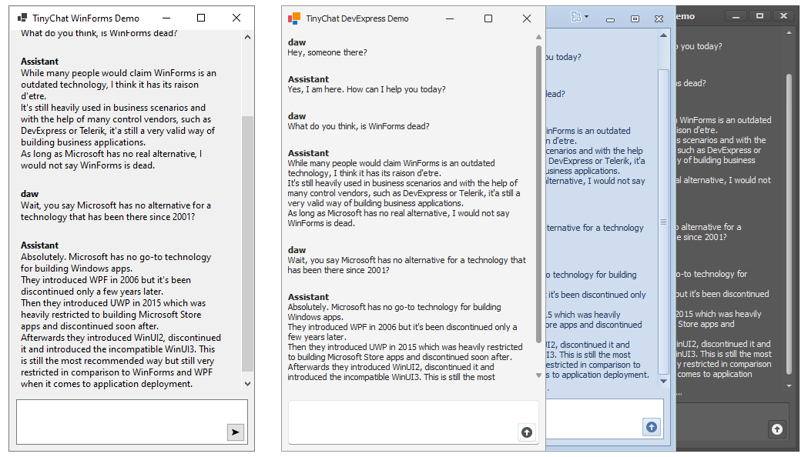

# TinyChat 💬

A minimalistic but extensible chat control library for Windows Forms.



## ✨ Features

- **Simplistic Chat Interface**: Clean, responsive chat UI with message history and input controls
- **Streaming Support**: Real-time message streaming for AI assistants and live conversations
- **Basic formatting support**: Supports cleaning HTML and Markdown formatting for WinForms controls and basic HTML and Markdown support for DevExpress controls
- **Extensible Architecture**: Interface-driven design allowing custom message types and custom UI components
- **Made for WinForms**: Because business applications might need AI chats, too

## 💖 Motivation

While there are countless web-based chat controls, there's nearly to none for the good old Windows Forms ecosystem and this is not surprising. However, I needed a very basic user interface to interact with AI models within an WinForms application. 

DevExpress, the component vendor of my choice, [has a very nice chat control](http://docs.devexpress.com/WindowsForms/405218). However, it's built upon web technologies and with that [it introduces a significant number of dependencies to ship](https://supportcenter.devexpress.com/ticket/details/t1294891/aichatcontrol-without-webview). I didn't want to pack additional 50MB of assemblies for a single control and theirs is so feature-rich that I would have to to disable 90% of it's functionality nevertheless.

That's why I quickly hacked down TinyChat. I hope this might help anyone out there. But please keep in mind that I never inteded to build a full-featured chat client with advanced text formatting support and so on. If you need more features, please consider sending pull-requests or using the DevExpress chat control.

## 🤷‍♂️ Not implemented

### Not planned

These features are not implemented and I don't plan to implement them. However, I'd be happy to review pull-requests.

- Full formatting support
  > [Basic formatting is supported](https://github.com/awaescher/TinyChat/pull/1) but full formatting spec support will be very hard to do in Winforms. Especially because AI assistants can come up with pretty much every flavor of formatting like HTML, Markdown, RTF, etc.
- File attachment support
- Image support
- everything else you know from chatbots

### Might come
- Designer support for properties like UI settings like Fonts, Splitter position, ...
- Select and copy texts
- Starting new chats

## 🚀 Quick Start

### Basic Usage

The chat control provides a `Messages` property that can be set to provide message history.
When the user is sending messages, the events `MessageSending` and `MessageSent` gets fired to prevent or react on user messages.

```csharp
using TinyChat;

var chatControl = new ChatControl();
chatControl.Dock = DockStyle.Fill;
Controls.Add(chatControl);

// Set up message handling
chatControl.MessageSent += (sender, e) =>
{
    // Handle user messages
    Console.WriteLine($"User sent: {e.Content}");
    
    // Add a response
    chatControl.AddMessage(
        new NamedSender("Assistant"), 
        new StringMessageContent("Hello! How can I help you?")
    );
};

```

### Streaming Messages with IAsyncEnumerable

Use `AddStreamingMessage()` to pass in a stream of tokens asynchronously. The chat component will take care of updating the user interface from background threads.

```csharp
IAsyncEnumerable<string> stream = ...;
chatControl.AddStreamingMessage(new NamedSender("AI Assistant"), stream);
```

### Formatting

WinForms controls don't support partial text formatting. To make the WinForms ChatControl usable with AI chatbots, TinyChat will try to remove basic HTML and Markdown formatting. 

The DevExpress Demo goes even further and makes use of the [basic HTML support with DevExpress controls](https://docs.devexpress.com/WindowsForms/4874/common-features/html-text-formatting) and tries to turn HTML or even Markdown input into these basic HTML tags. Tags that are not supported are stripped out to keep the text readable.


You can use your own formatter by implementing `IMessageFormatter` and instantiating it in `ChatControl.CreateDefaultMessageFormatter`.

## 🎬 Demos

The repository includes two pretty similar demo applications:
- A basic Windows Forms application with dependency-free standard controls
- A DevExpress powered application showcasing the customizability with skinned DevExpress components *(requires a DevExpress license)*

```bash
dotnet run --project WinFormsDemo
dotnet run --project DevExpressDemo
```

## Credits

The package icon was made by [Vectors Market](https://www.flaticon.com/authors/vectors-market) and is licensed by the [Flaticons license](https://www.flaticon.com/legal).
